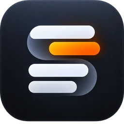

<p align="center">
  
</p>

<h1 align="center">Subti</h1>

<p align="center">
  <b>macOS subtitle learning app</b><br>
  <i>Learn languages from films without leaving VLC.</i>
</p>

<p align="center">
  <a href="https://subti.app"><b>Website</b></a> &nbsp;·&nbsp;
  <a href="https://subti.app/download"><b>Download</b></a> &nbsp;·&nbsp;
  <a href="./CHANGELOG.md"><b>Changelog</b></a> &nbsp;·&nbsp;
  <a href="https://subti.app/support"><b>Support</b></a>
</p>

<p align="center">
  <a href="https://github.com/troshkinpavel/subti-releases/releases/latest"></a>
  
  
</p>

---

Subti draws VLC's subtitles itself, so every word is clickable. Hold <kbd>⌥</kbd> and click one: the
film pauses, and a model running on your own Mac translates it — reading the whole line, so it knows
the difference between *count* and *count on*. Close the card and playback continues. Every word you
looked up is waiting afterwards, ready to be kept and reviewed.

**This repository is a public mirror.** Releases and their checksums are published here so a
download can be checked against a second source. The app's source code is private, and Subti updates
itself from [subti.app](https://subti.app) — never from GitHub.

## What it does

- **Clickable subtitles over VLC.** Your player, your files. Clicks pass through to VLC unless you hold the key.
- **A word or a whole phrase**, translated in the context of the line it appeared in.
- **The line's own audio**, cut from the film and played in the actor's voice.
- **History, then a dictionary.** Keep what is worth learning, review it with spaced repetition.
- **Export** to plain JSON, or to an Anki deck carrying the line, its audio and the frame.
- **76 languages.** English → Russian is only the default.

## Requirements

- macOS 14 or later
- [VLC](https://www.videolan.org) 3.0 or later
- Apple silicon to run a model inside the app — an Intel Mac can use Ollama or macOS Translate
- Accessibility and Automation permission, which the app asks for on first launch

## Privacy

Everything happens on your Mac. Translation runs locally, and the films you watch, the words you
look up and the dictionary you build never leave the machine — no account, no telemetry. Full
details: [subti.app/privacy](https://subti.app/privacy).

## Download

**[subti.app/download](https://subti.app/download)** — always the current version.

Each version is also attached to its entry under
[Releases](https://github.com/troshkinpavel/subti-releases/releases), with a `SHA256SUMS.txt` to
check it against:

```bash
shasum -a 256 -c SHA256SUMS.txt
```

## Licence

One purchase, no subscription. A licence is for one person and can be active on **up to 2 Macs** at
a time. Updates are included and it does not expire.
Terms: [subti.app/terms](https://subti.app/terms).

## Support

[**support@subti.app**](mailto:support@subti.app) · [subti.app/support](https://subti.app/support) ·
[open an issue](https://github.com/troshkinpavel/subti-releases/issues)

Security problems go privately to the same address — see [SECURITY.md](SECURITY.md).
